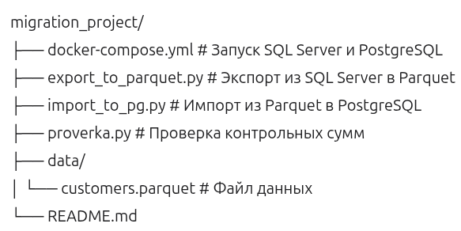

```markdown
# Миграция данных: SQL Server → PostgreSQL

## Описание

Проект демонстрирует миграцию данных из Microsoft SQL Server в PostgreSQL с использованием формата Parquet для безопасной передачи данных, содержащих специальные символы, переносы строк и кириллицу.

## Стек технологий

- Docker
- Microsoft SQL Server 2022
- PostgreSQL 15
- Python 3.8+
- `pyodbc`, `pandas`, `sqlalchemy`
- Parquet (pyarrow)

## Структура проекта

```

```

## Установка

1. Установите зависимости:
   ```bash
   pip install pyodbc pandas sqlalchemy psycopg2-binary pyarrow
   ```

2. Установите `ODBC Driver 17 for SQL Server`:
   ```bash
   curl -sSL https://packages.microsoft.com/keys/microsoft.asc | sudo apt-key add -
   sudo add-apt-repository "$(curl -sSL https://packages.microsoft.com/config/ubuntu/20.04/prod.list)"
   sudo apt-get update
   sudo apt-get install msodbcsql17 mssql-tools unixodbc-dev
   ```

## Запуск

1. Запустите контейнеры:
   ```bash
   docker-compose up -d
   ```

2. Подождите запуска SQL Server (30-60 секунд):
   ```bash
   docker-compose logs sqlserver | grep -i "ready for client connections"
   ```

3. Создайте базу и таблицу в SQL Server (в DBeaver или `sqlcmd`):
   ```sql
   CREATE DATABASE RetailSource;
   USE RetailSource;

   CREATE TABLE customers (
       id int IDENTITY(1,1) PRIMARY KEY,
       name nvarchar(255) NOT NULL,
       email nvarchar(255),
       created_at datetime2,
       is_active bit DEFAULT 1,
       notes ntext
   );

   INSERT INTO customers (name, email, created_at, is_active, notes) VALUES
   (N'Иван Петров', 'ivan@test.com', '2023-01-15 10:30:00', 1, N'Заметки, "в кавычках", с запятыми'),
   (N'Мария Сидорова', 'maria@test.com', '2023-02-20 14:22:00', 0, N'Перенос строки' + CHAR(13) + CHAR(10) + N'в середине'),
   (N'Анна, О''Нил', 'anna@test.com', '2023-03-10 09:15:00', 1, N'Special chars: \\x01 \\x02'),
   (N'Дмитрий Кузнецов', 'dmitry@test.com', '2023-04-05 16:45:00', 1, NULL),
   (N'Ольга "Смайли"' + CHAR(10) + N'Иванова', 'olga@test.com', '2023-05-12 11:30:00', 0, N'Многострочный текст');
   ```

4. Экспорт в Parquet:
   ```bash
   python export_to_parquet.py
   ```

5. Импорт в PostgreSQL:
   ```bash
   python import_to_pg.py
   ```

6. Проверка контрольных сумм:
   ```bash
   python proverka.py
   ```

## Почему Parquet?

- **Типизированные данные** — нет потери типов при миграции
- **Безопасность** — спецсимволы, переносы строк не ломают структуру
- **Компрессия** — меньший размер файла
- **NULL-значения** — корректная передача пропущенных данных

## Ошибки, которых избежали

- `bcp + COPY` — ломается на `\r\n` и специальных символах
- `CSV` — не подходит для грязных данных
- `ntext` в `CHECKSUM` — требует преобразования в `nvarchar`
- `COPY` vs `\copy` — разные пути доступа к файлам

## Результат

- 5 строк успешно мигрировано
- Контрольные суммы совпадают
- Данные без искажений
- Безопасная миграция
